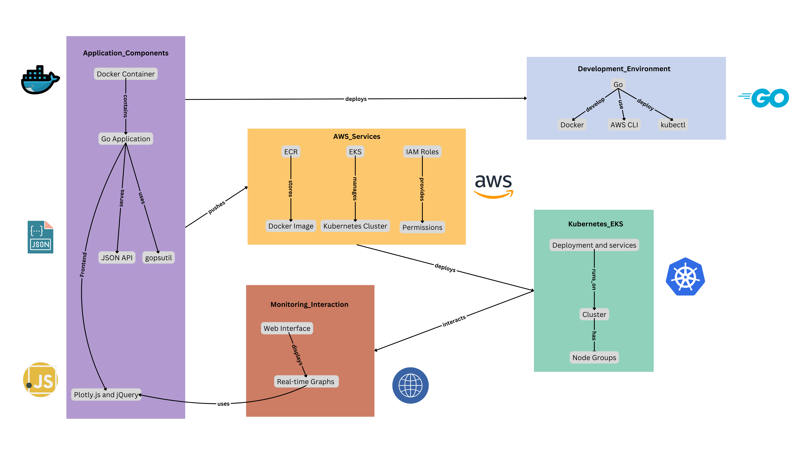
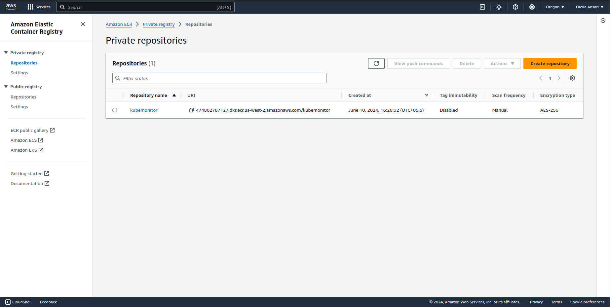
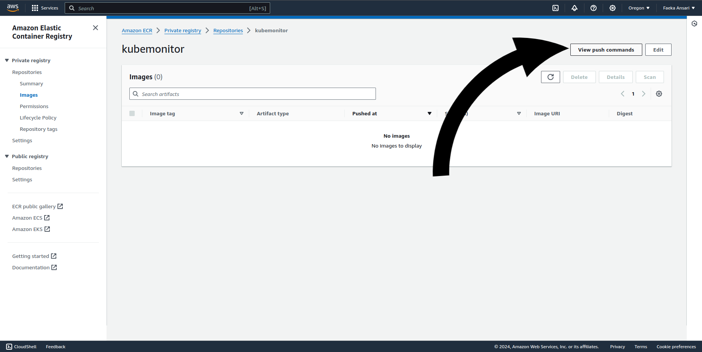
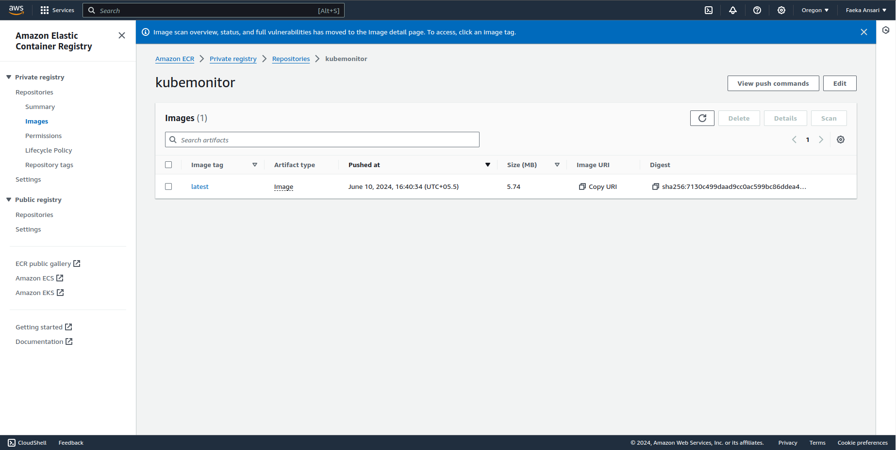

# go-kubemonitor-on-aws

## Overview

This project is a Cloud Native system resource monitoring application built with the Go Programming Language and deployed on Kubernetes (K8s) with AWS Elastic Container Registry (ECR).

## Architecture Diagram



## Setting Up Your Development Environment

1. **Install Go**: [Go installation guide](https://golang.org/doc/install)
2. **Install Docker**: [Docker installation guide](https://docs.docker.com/get-docker/)
3. **Install AWS CLI**: [AWS CLI installation guide](https://docs.aws.amazon.com/cli/latest/userguide/install-cliv2.html)
4. **Install kubectl**: [kubectl installation guide](https://kubernetes.io/docs/tasks/tools/install-kubectl/)
5. **Configure AWS CLI**: Run `aws configure`

You will need a code editor (e.g., VS Code).

## Building the Project

### Step 1: Build the Go Application

#### Tools and Packages Used
- Go
- gopsutil package
- HTML, JavaScript, jQuery, Plotly.js

1. **Create a Monitoring Application using Go**:
    - Fetch CPU and memory usage using the `gopsutil` package.
    - Serve the data as a `JSON API`.
    - Create a dynamic front-end using `Plotly.js` and `jQuery` for real-time updates.

#### Backend
- **Go**: Used with `gopsutil` to fetch CPU & memory usage.
- **JSON API**: Endpoint to serve system metrics as `JSON`.

#### Frontend
- **HTML & JavaScript**: For UI.
- **Plotly.js**: For dynamic graphs.
- **jQuery**: For AJAX calls.

**Code Files**:
- `main.go`: Contains the Go backend code.
- `index.gohtml`: Contains the HTML code for the front-end.

**Steps to Run the Code**:
1. Clone the repository and navigate to the root directory.
2. Run the Go application:
    ```sh
    go run main.go
    ```
3. Open a web browser and navigate to `http://localhost:8080` to see the UI.

### Step 2: Containerize the Application

#### Tools and Packages Used
- Docker

#### Key Learning Points
- Learning Docker and how to containerize a Go application.
- Creating a Dockerfile.
- Building a Docker image.
- Running a Docker container.
- Docker commands.

1. **Create Dockerfile**:
    - The Dockerfile is located in the root directory and named `docker/Dockerfile`.
    - **What the Dockerfile does**:
        - **Stage 1**: Uses a Golang image to build the Go application. [For more information](https://hub.docker.com/_/golang).
        - **Stage 2**: Creates a minimal image containing only the necessary files to run the application.
    - **Optimisation**: We are using multi-staged builds to optimise by separating the builds from final runtime env, and reducing the size of the final image.


2. **Build Docker Image**:
    ```sh
    docker build -f docker/Dockerfile -t kubemonitor .
    ```
   PTR: Docker does not allow accessing files outside the build context directory. Hence, you should run the docker build command from the parent directory and specify the path to the Dockerfile using the `-f` flag.

3. **Run Docker Container Locally**:
    ```sh
    docker run -p 8080:8080 kubemonitor
    ```

## Step 3: Create an Elastic Container Registry Programmatically using Go

#### Tools and Packages Used
- [AWS SDK for Go](https://aws.github.io/aws-sdk-go-v2/)

#### Key Learning Points
- Creating an ECR repository using Go.
- Pushing a Docker image to ECR.


1. Write program for creating ECR
   - Write Go code to interact with AWS SDK and create an ECR repository.
   - Refer to the code in the `ecr.go` file in this repository.
   - Run `go get` for the following packages:
     ```go
     go get github.com/aws/aws-sdk-go-v2/aws
     go get github.com/aws/aws-sdk-go-v2/config
     go get github.com/aws/aws-sdk-go-v2/service/ecr
     ```

2. Create the ECR
   - Use the code file `ecr.go` to create an ECR repository programmatically in AWS by running `go run ecr.go`. 
   - Follow the link displayed on the screen.
   

3. Deploy Images to This ECR Repo Using Commands

   - Visit the ECR repositories management console. 
   - Select the `kubemonitor` repository created programmatically. 
   - Click on the "View push commands" button. 
   - 
   - Copy and paste the push commands into your terminal to push your project's Docker image to ECR.
   
      ```sh
      $ aws ecr get-login-password --region us-west-2 | docker login --username AWS --password-stdin 474802787127.dkr.ecr.us-west-2.amazonaws.com
      Login Succeeded
      $ docker build -t kubemonitor ../docker/
      cd .. && docker build -f docker/Dockerfile -t kubemonitor .
      [+] Building 12.6s (14/14) FINISHED
      $ docker tag kubemonitor:latest 474807127.dkr.ecr.us-east-2.amazonaws.com/kubemonitor:latest
      $ docker push 474807127.dkr.ecr.us-east-2.amazonaws.com/kubemonitor:latest 
      The push refers to repository [474802787127.dkr.ecr.us-west-2.amazonaws.com/kubemonitor]
      ff5efa5d43: Pushed
      904bfb4dc0: Pushed
      c0b1668132: Pushed
      latest: digest: sha256:7130c499daad9cc0ac599bc86d06bafc97727 size: 942
      ```
   - Image is now pushed to ECR
      
For detailed guide refer aws-ecr/README.md   

## Step 4: Deploy on Kubernetes (EKS)

1. creating an eks k8s cluster with nodes
2. open eks
3. create cluster, give name
4. defaults
5. 4 subnets
6. defaults
7. ONCE cluster is created
8. create a node group - give a name, attach an iam
9.


we will use go client for kubernetes to manage kubernetes. for this we will use a client [go library](https://pkg.go.dev/k8s.io/client-go/kubernetes)


### Key Learning Points
- Learning Kubernetes.
- Creating an EKS cluster and node groups.
- Creating Kubernetes deployments and services using Go.
- Client Go Library

## Tip for Efficient Learning
To gain deeper insights into the project's development, check out the [branches](https://github.com/fykaa/go-kubemonitor-on-aws/branches) and [PR commits](https://github.com/fykaa/go-kubemonitor-on-aws/pulls?q=is%3Apr+label%3Aoptimization+). Each pull request documents the iterative improvements and thought process behind optimizing the project. This approach will help you understand the evolution of the project from the initial version to the optimized version.
